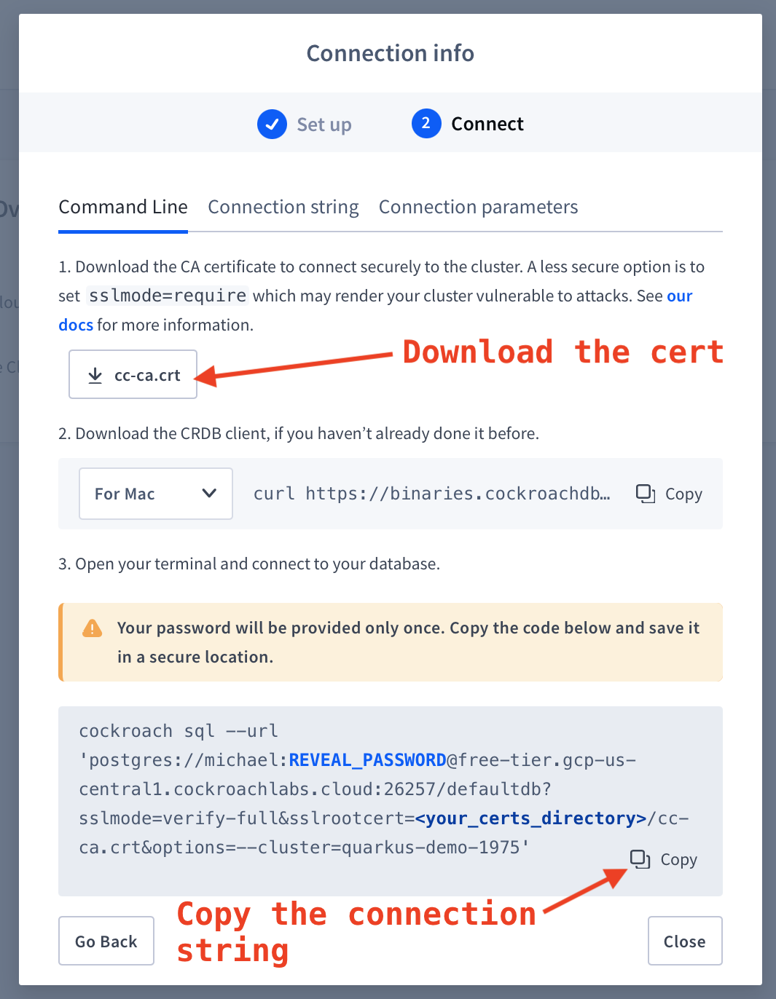

# Demo: Securely connect a Quarkus Java app to your CockroachCloud Free Tier database

[Quarkus](https://quarkus.io) is a full-stack, Kubernetes-native, Java
Application Framework. You can use it to build an _uber JAR_ containing your
application, along with its dependent JAR files, for easy deployment. It seems
similar to Spring Boot in some ways.

[CockroachCloud](https://www.cockroachlabs.com/product/cockroachcloud/) is a
managed CockroachDB service which features a free tier so you can experiment
without having to pay.

The purpose of this demo is to illustrate how to build and run a Quarkus app in
a GKE cluster and have the app connect to a CockroachCloud database instance
using the SSL `verify-full` setting to prevent man-in-the-middle attacks.  This
`verify-full` configuration setting requires the app to have filesystem access
to the CockroachCloud certificate, which poses challenges when running in
Kubernetes (or, it did for me).

Here's the procedure:

## Spin up a K8s cluster in GKE (if you don't already have access to a K8s cluster)

[Here](https://cloud.google.com/kubernetes-engine/docs/quickstart) are Google's
docs on this topic.  The `$` represents the shell command prompt.

```
$ gcloud container clusters create quarkus-crdb --num-nodes=1
```

That will run for a couple of minutes.  Once it's finished, proceed to:

```
$ gcloud container clusters get-credentials quarkus-crdb
```

## (Optional) Build the app

The app was taken from [this example](https://www.coding-daddy.xyz/node/45),
though I apparently messed it up slightly since the `GET` part of it isn't
working. FIXME

```
$ mvn clean package
```

## (Optional) Build the Docker image and publish it

There is an existing Docker image (`mgoddard/quarkus-crdb`) you can use for this; if you want
to use that image, just skip this section.

I have provided the scripts I used to build, tag, test and publish the app's Docker image:

* `Dockerfile`: Probably okay as it is. This refers to [entrypoint.sh](./entrypoint.sh).
* `include.sh`: Edit this since constants defined here are referenced by the `docker_*.sh` scripts.
* `docker_build_image.sh`: Builds the image
* `docker_tag_publish.sh`: Tags and publishes the image (requires a Docker Hub account)
* `docker_run_image.sh`: Runs the image locally
* `entrypoint.sh`: This is copied into the image and translates the environment variables defined in
  [the K8s deployment](./quarkus-crdb.yaml) into Java properties, and it also starts the app.

## Sign up for CockroachCloud and start up a Free Tier instance

* Open [this URL](https://cockroachlabs.cloud/signup) and sign up.  You can _Sign up with GitHub_ to
avoid having to enter data into the form.
* Once logged in, click the _Create Cluster_ button.
* _CockroachCloud Free_ should be selected by default.
* To change the region, click _Additional configuration_ and then you are able to use the drop-down
control under _Regions_.  You can also choose a _Cluster Name_.
* Click _Create your free database_ on the right side of the UI.
* A dialog will appear, telling you the cluster is being created.
* Finally, your _Connection info_ dialog appears, from which you will (see image below):
  - Download your `cc-ca.crt` certificate file
  - Copy (and save) your connection string




